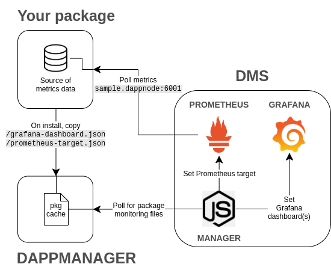

# DMS Dapnode Package

[](http://my.dappnode/#/installer/dms.dnp.dappnode.eth)

**D**appnode **M**onitoring **S**ervice

This package privately and locally collects and displays metrics related to your dappnode and its packages. Based on Grafana and Prometheus

---


---

## How does it work?

According to the following diagram, the DMS package provides a high level of abstraction, allowing any new DAppNode package developed to easily implement grafana and prometheus.



### Instructions to implement Grafana and Prometheus in your DAppNode package:

- **prometheus-targets.json** file: specifying the domain and the port where the data will be published.
- **name-grafana-dashboard.json** file: specifying the grafana dashboard to be used.

If you want to learn more about how do Grafana and Prometheus work, visit this [link](https://prometheus.io/docs/visualization/grafana/)

## How to add a custom prometheus endpoint

In order to add a custom path to prometheus you need to overwrite the `__metrics_path__` label (by default `/metrics`), so that you can define diferent and specific metrics paths per target, like this:

```
[
    {
        "labels": {
            "package": "tg.turbo-geth.dnp.dappnode.eth",
            "service": "tg.turbo-geth.dappnode",
            "__metrics_path__": "/debug/metrics/prometheus"
        },
        "targets": [
            "tg.turbo-geth.dappnode:6060"
        ]
    }
]
```

## License

This project is licensed under the GNU General Public License v3.0 - see the [LICENSE](LICENSE) file for details
